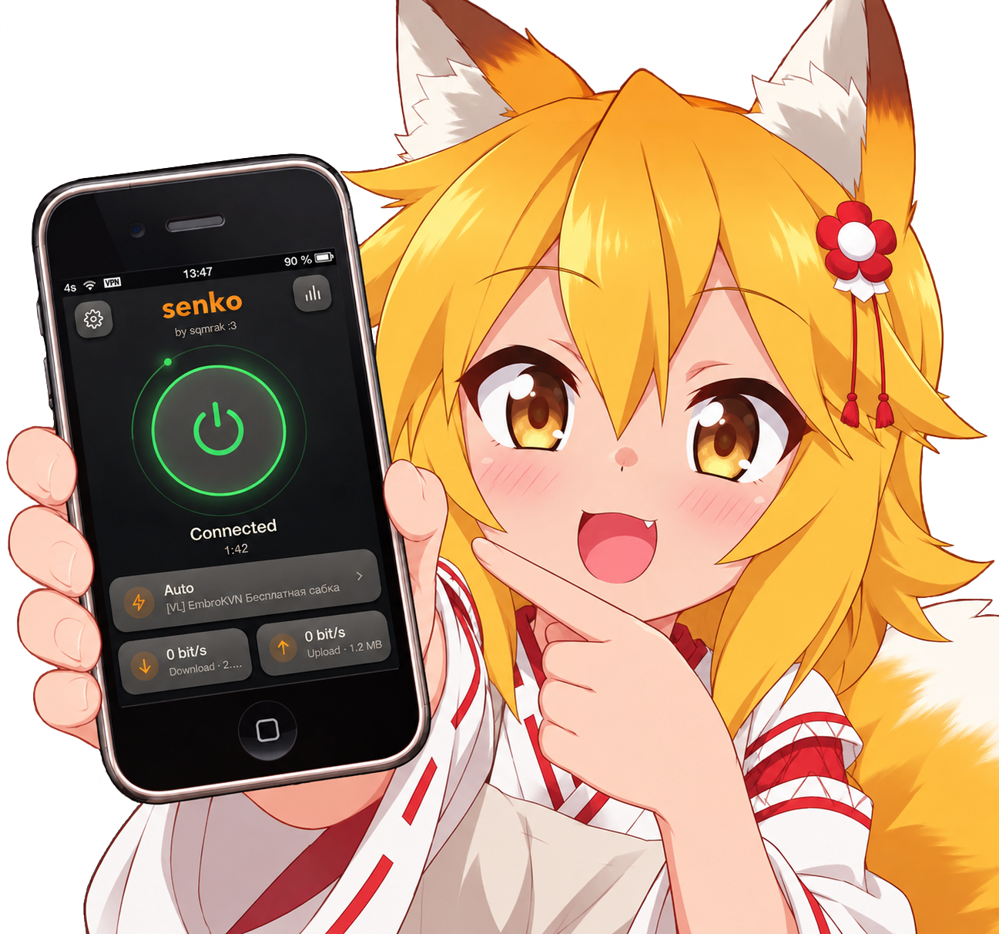

# senko

<p align="center">
  
</p>

<p align="center"><b>vless, hysteria2 and amneziawg for the whole device, ios 5 to 16, one deb</b></p>

> [!NOTE]
> all devices need a jailbreak.

## devices

- ios 5-6: armv7
- ios 7-11: armv7, arm64
- ios 12-16: arm64, arm64e

## protocols

- vless: tcp, tls, reality, websocket, xhttp, grpc
- hysteria2
- amneziawg
- socks5, http(s)

subscriptions: uri lists, base64, happ, xray/sing-box json, clash yaml, shadowrocket/surge ini.

## subscriptions

Tap **+** and **Add subscription** to save a URL. The **•••** button stays at
the top of the server list. It opens subscription actions directly when there
is one subscription, or lets you choose one when there are several. Each
subscription heading has the same button. Use it to refresh, check ping, view
details, edit the name or URL, or remove the subscription and its servers.
The refresh and ping icons beside the heading run those checks directly. Tap
the heading to fold or unfold its servers.

## features

- servers and subscriptions, paste, qr and file import
- parallel checks, even with the vpn on
- rules: proxy, direct, block
- failover and auto reconnect
- russian, english, chinese
- diagnostics in the app or `senkoctl`

## install

repo: `https://sqmrak.github.io/sqmrakdev/`

```bash
scp senko-*.deb root@<device-ip>:/var/mobile/
ssh root@<device-ip> dpkg -i /var/mobile/senko-*.deb
```

remove: `dpkg -r com.senko.daemon`

## paths

- config: `/var/root/Library/Preferences/senko.cfg`
- socket: `/var/tmp/senkod.sock`
- log: `/var/log/senko-system.log`
- diagnostics: `Documents/senko-diagnostics.txt`

## build

```bash
make -C tests test
./build_deb.sh
```

needs `THEOS SENKO_SDK_V7 SENKO_SDK_V64 SENKO_SDK_VE SENKO_CRT_V7 SENKO_OSSL_V7 SENKO_OSSL_V64 SENKO_MBED SENKO_GO SENKO_CORE_SRC`, outputs `senko-v<version>.deb`.

## license

[gpl v2](LICENSE). emoji: Twemoji, CC BY 4.0 (`app/emoji/`).
